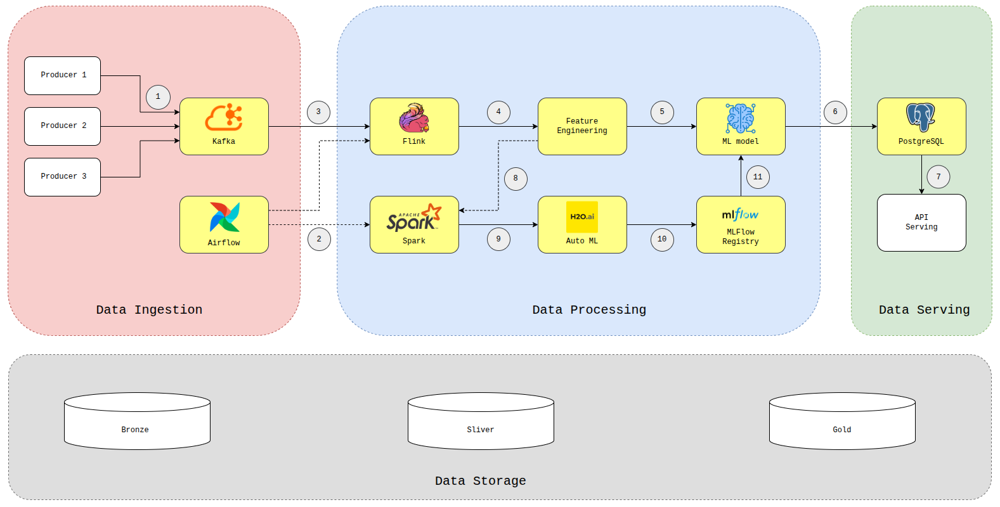

# Traffic Risk Assessment Platform

<p align="center">
  
  
  
  
  
  
  
  
  
  
</p>

Production-oriented Big Data platform for analyzing traffic risk from two coordinated sources: US accident replay data and live TomTom traffic incidents. The system pretrains on pre-2020 US accidents, replays post-2020 US accidents as a realtime stream, ingests TomTom incidents as a live stream, retrains the US model from accumulated replay features, and exposes analytical APIs for a dashboard layer.

## Problem Statement

Given an accident that has already occurred and includes time, location, weather, and road context, the platform predicts its severity on a 4-level scale (`Severity 1 -> 4`).

This repository focuses on the full data and ML pipeline:

- replaying post-2020 US accident events into Kafka topic `traffic.us.raw`
- ingesting TomTom live incidents into Kafka topic `traffic.tomtom.raw`
- streaming feature engineering with one unified Flink job
- running H2O/MLflow inference only for US replay events
- writing US and TomTom serving records to separate PostgreSQL/PostGIS tables
- batch Silver-to-Gold processing with Spark
- scheduled retraining with H2O AutoML and MLflow
- serving predictions and analytics through FastAPI

## Team Members

| Member | Student ID |
| --- | --- |
| Nguyễn Hữu Hải Đăng | 23020524 |
| Phạm Huy Hiếu | 23020535 |
| Phạm Khánh Duy | 23020522 |
| Đặng Quốc Huy | 23020539 |
| Phạm Việt Hưng | 23020542 |

## Architecture



The deployed cloud topology uses three Google Compute Engine VMs:

| Node | Role | Main Services |
| --- | --- | --- |
| `node1-control` | Control plane | PostgreSQL/PostGIS, Airflow, MLflow, FastAPI, Prometheus, Grafana |
| `node2-streaming` | Streaming plane | Kafka, Flink, Redis, replay producers |
| `node3-batch` | Batch plane | Spark Silver-to-Gold processing, H2O retraining |

End-to-end data flow:

```text
US pre-2020 Bronze CSV / GCS
  -> H2O offline training
  -> MLflow Model Registry

US post-2020 Bronze CSV / GCS
  -> Kafka replay producer
  -> Flink feature engineering + MLflow inference
  -> Silver JSONL + PostgreSQL traffic_risk_predictions
  -> Spark batch cleaning / dedup / partitioning
  -> Gold Parquet + CSV
  -> H2O AutoML retraining
  -> MLflow Model Registry

TomTom Incident API
  -> Kafka TomTom producer
  -> Flink TomTom enrichment + rule-based severity
  -> PostgreSQL traffic_tomtom_incidents

TomTom severity is derived from `magnitudeOfDelay` and `iconCategory`, then
mapped to a display risk score for the dashboard. It is intentionally excluded
from Spark, MLflow, and H2O.

PostgreSQL + MLflow + Prometheus
  -> FastAPI analytics and prediction APIs
  -> Dashboard / Grafana
```
## Dataset Strategy

The pipeline uses a strict temporal split to avoid leakage:

| Split | Time Range | Rows | Role |
| --- | --- | ---: | --- |
| `before_2020_raw` | 2016-2019 | 2,976,413 | offline pretraining data |
| `from_2020_raw` | 2020-2023 | 3,786,927 | realtime replay simulation |
| `before_2020_featured` | 2016-2019 | 2,975,837 | engineered training set |

This design enforces:

- `before 2020` for offline model selection and initial training
- `from 2020` for replay, online inference, and hourly retraining inputs

## EDA Highlights

The detailed EDA summary is in [ml/notebooks/eda.md](ml/notebooks/eda.md).

Key findings used in modeling decisions:

1. The temporal split is clean and operationally meaningful.
2. Feature engineering is stable: `before_2020_raw` and `before_2020_featured` differ by only a small number of rows.
3. Severity is highly imbalanced before 2020: class `2` = `67.03%`, class `3` = `29.84%`, class `4` = `3.10%`, class `1` = `0.03%`.
4. Weather, road-type, time-of-day, and night/rush-hour signals all contribute useful structure.
5. There is clear drift after 2020, especially in label distribution, so replay data must not be mixed blindly into initial offline training.

## Core Capabilities

| Layer | What it does |
| --- | --- |
| Ingestion | Reads post-2020 CSV rows and publishes raw JSON events to Kafka topic `traffic.us.raw` |
| Streaming | One Flink job reads US and TomTom Kafka topics in parallel; US calls MLflow/H2O, TomTom uses rule-based severity |
| Batch | Spark validates schema, fills defaults, removes duplicates, and writes Gold Parquet/CSV |
| Training | H2O AutoML trains or retrains severity models and logs runs to MLflow |
| Orchestration | Airflow triggers hourly retraining and health-check DAGs |
| Serving | FastAPI exposes overview, prediction, hotspot, analytics, system, model, and pipeline endpoints |
| Dashboard | Map modes: Replay circles, Live TomTom triangles, and Full combined view |
| Monitoring | Prometheus and Grafana collect runtime health and API metrics |

## Tech Stack

| Category | Stack |
| --- | --- |
| Data processing | Apache Kafka, Apache Flink, Apache Spark |
| ML lifecycle | H2O AutoML, MLflow Model Registry |
| Serving | FastAPI, PostgreSQL, PostGIS, Redis |
| Orchestration | Apache Airflow |
| Monitoring | Prometheus, Grafana |
| Infrastructure | Docker Compose, Google Compute Engine, Google Cloud Storage |
| Language | Python |

## Repository Structure

```text
assets/                      Architecture image and visual assets
dashboard/backend/           FastAPI backend for dashboard and analytics APIs
dashboard/frontend/          Frontend reference baselines and UI concepts
deployment/                  Per-node Docker Compose manifests
docs/                        Runbooks and technical documentation
ingestion/kafka/             Kafka replay producer
ml/notebooks/                EDA notebook and markdown summary
ml/training/                 H2O training and retraining scripts
orchestration/dags/          Airflow DAGs
processing/                  Shared feature engineering, Flink, and Spark jobs
scripts/gcp/                 Cloud provisioning and node operations
scripts/local/               Local smoke pipeline runner
tests/                       Unit and smoke tests
vendor/                      Reference projects from previous cohorts
```

## API Surface

The FastAPI service currently exposes:

- `/health`
- `/metrics`
- `/api/v1/overview/*`
- `/api/v1/predictions/*`
- `/api/v1/hotspots/*`
- `/api/v1/scenarios/*`
- `/api/v1/analytics/*`
- `/api/v1/system/*`
- `/api/v1/model/*`

Example local checks:

```bash
curl -fsS http://localhost:8000/health
curl -fsS http://localhost:8000/api/v1/system/status
curl -fsS http://localhost:8000/api/v1/overview/summary
```

## Local Development

Prerequisites:

- Python `3.10+`
- Docker + Docker Compose
- `uv`

Prepare the workspace:

```bash
cp .env.example .env
uv sync --group dev
```

This project is cloud-first. For full end-to-end runs, use the cloud pipeline and the runbook in [docs/run.md](docs/run.md). Keep local execution limited to validation or smoke checks on low-spec laptops.

Run validation:

```bash
make -f makefile/local/Makefile validate
```

Run the local smoke pipeline:

```bash
make -f makefile/local/Makefile pipeline
```

Run the full local pipeline with bounded training:

```bash
LOCAL_SAMPLE_ROWS=0 LOCAL_RUN_TRAINING=true \
make -f makefile/local/Makefile full-pipeline
```

Useful local targets:

```bash
make -f makefile/local/Makefile up
make -f makefile/local/Makefile up-batch
make -f makefile/local/Makefile up-orchestration
make -f makefile/local/Makefile logs
make -f makefile/local/Makefile reset-realtime
```

## Cloud Deployment

This project is cloud-first and targets `big-data-group-4` on GCP.

Validate deployment manifests:

```bash
make -f makefile/gcp/Makefile validate
```

List traffic VMs:

```bash
make -f makefile/gcp/Makefile list
```

Deploy Node 1 and start Node 2 plus Node 3 in sync:

```bash
make -f makefile/gcp/Makefile deploy-all
```

Reset and run the full cloud pipeline from the beginning:

```bash
BRANCH=main make -f makefile/gcp/Makefile full-reset-run
```

Collect measured evidence after a run:

```bash
make -f makefile/gcp/Makefile collect-metrics
```

Useful operational commands:

```bash
make -f makefile/gcp/Makefile status
make -f makefile/gcp/Makefile kafka-topic-check
make -f makefile/gcp/Makefile reset-realtime
```

For the full cloud runbook, see [docs/run.md](docs/run.md).

## Current Scope And Limitations

- The backend API is implemented and usable.
- The cloud deployment serves the Next.js dashboard on Node 1 at port `3001`.
- US replay and TomTom live data are active but intentionally stored in separate PostgreSQL tables.
- TomTom risk coloring is rule-based from TomTom delay/icon signals; it is not an H2O prediction.
- The main modeling challenge is severe class imbalance, especially for class `1`.

## References

- US Accidents dataset paper: <https://arxiv.org/pdf/1906.05409>
- Project EDA summary: [ml/notebooks/eda.md](ml/notebooks/eda.md)
- Cloud runbook: [docs/run.md](docs/run.md)
- Backend API notes: [docs/api.md](docs/api.md)
