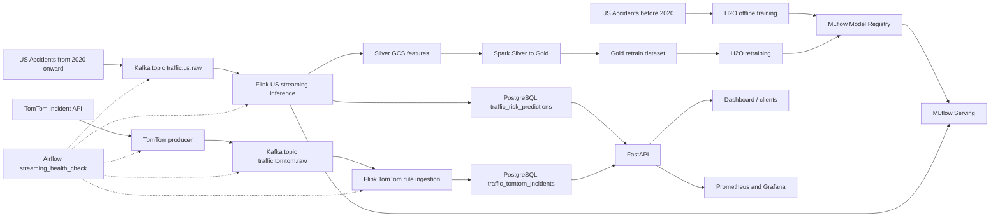

# Pipeline Overview

This project runs two coordinated traffic streams with separate data contracts.

## Data Flows



## US Replay Stream

The US stream keeps the existing ML workflow:

- The initial H2O model is trained only on pre-2020 US accident data.
- Post-2020 US records are replayed through Kafka as realtime events.
- Flink US reads only `traffic.us.raw`.
- Flink builds the same feature contract used by offline training.
- Flink writes feature records to Silver GCS for Spark/H2O retraining.
- Flink calls MLflow Serving and writes H2O predictions to `traffic_risk_predictions`.

## TomTom Live Stream

The TomTom stream is intentionally separate from Spark, MLflow, and H2O:

- TomTom incidents are fetched from the live Incident Details API.
- The producer publishes normalized raw events to `traffic.tomtom.raw`.
- A dedicated Flink TomTom job reads only `traffic.tomtom.raw`.
- TomTom severity is rule-based from `magnitudeOfDelay` and `iconCategory`.
- TomTom writes `severity` and `tomtom_rule_score = (severity - 1) / 3`.
- Flink writes live records to `traffic_tomtom_incidents`.

TomTom is not passed through the US-trained H2O model because its label is rule-based and its timestamp distribution is current live traffic, not the historical US replay timeline.

## PostgreSQL Tables

- `traffic_risk_predictions`: US replay ML prediction table.
- `traffic_tomtom_incidents`: TomTom live rule-based incident table.

TomTom `severity` is a deterministic rule output, not an H2O prediction. Do not reuse the US `risk_score` semantic for TomTom; use `tomtom_rule_score`.

## Airflow

- `model_retrain_hourly` remains US-only: Spark reads US Silver data, creates Gold retraining data, and retrains the H2O model.
- `streaming_health_check` monitors Node 2 streaming only: Kafka, both raw topics, Flink JobManager, both Flink jobs, and `node2-tomtom-producer`.
- Spark/Node 3 is not part of the TomTom live streaming health check.

## Dashboard Modes

The map exposes three modes:

- `Replay`: US replay only, circular markers, color by H2O `risk_score`.
- `Live`: TomTom only, triangular markers, color by TomTom `tomtom_rule_score`.
- `Full`: US replay and TomTom live layers together with separate marker shapes.

## Monitoring

FastAPI exposes `/metrics` for Prometheus. Grafana is provisioned with a `Traffic Risk Platform` dashboard that tracks FastAPI throughput, request latency, and blackbox health probes.

After a full run, use:

```bash
make -f makefile/gcp/Makefile collect-metrics
```

The command writes measured evidence to `logs/cloud_runs/<run-id>/cloud-metrics.md`, including producer log rates, PostgreSQL row counts, end-to-end latency, Kafka offsets, Prometheus samples, and Docker service status.
